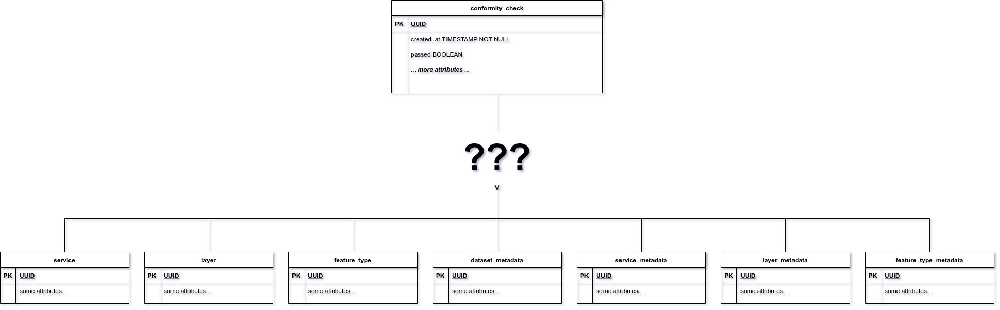
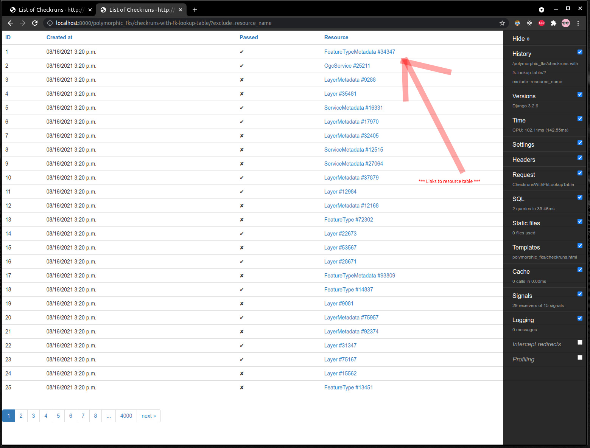
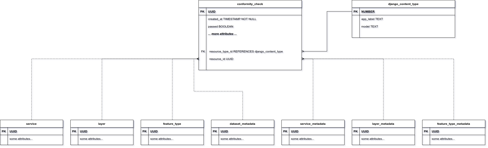
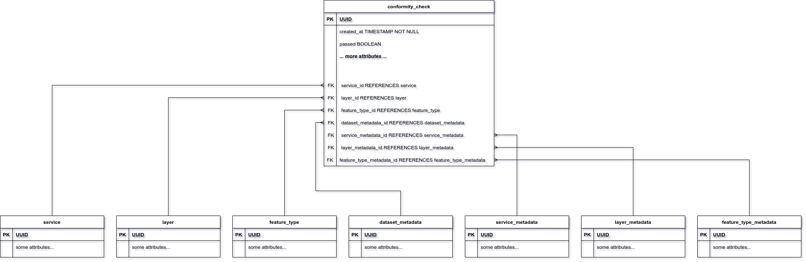
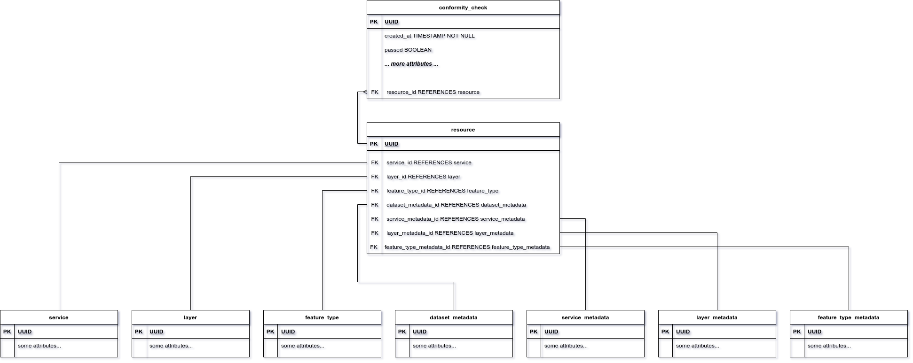
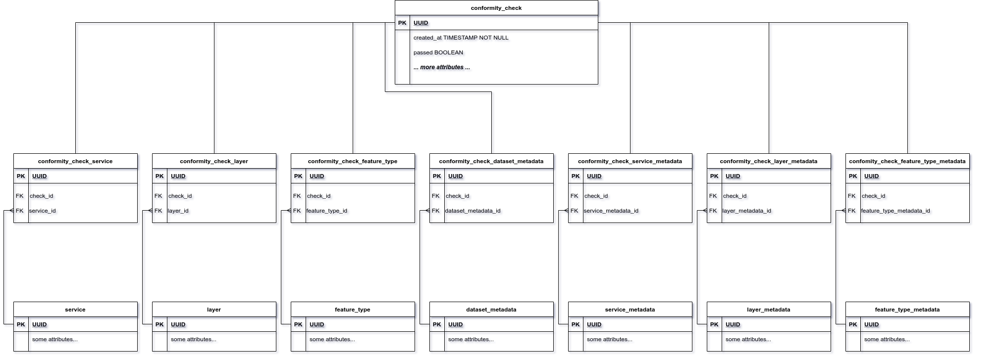
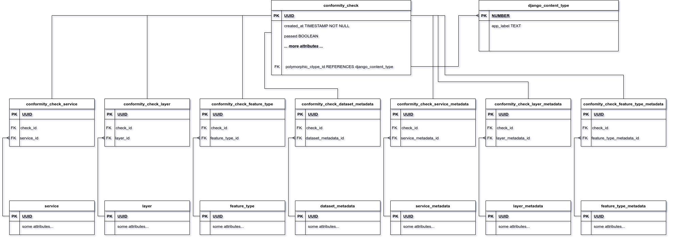

# Approaches to modelling polymorphic FKs and their implications

## Problem

In the course of #145, the question of the most suitable approach to modelling polymorphic references in MrMap came up
again. In this particular case, table `conformity_check` has an n:1 relation to the checked resource to be checked. A
resource could be any of the following concrete types:

* Service (WMS, WFS, CSW)
* Layer
* Feature Type
* Service Metadata
* Layer Metadata
* Feature Type Metadata

## Test scenario

To solve this problem, several different approaches are possible and in order to find the best one (and also to get more
confident in using the Django ORM), I implemented them and analyzed their performance and implications for a test
scenario:

| WMS    | WFS    | CSW    | Layers  | Feature Types | Service Metadata | Layer Metadata | Feature Type Metadata | Dataset Metadata |
|--------|--------|--------|---------|---------------|------------------|----------------|-----------------------|------------------|
| 10,000 | 10,000 | 10,000 | 100,000 | 100,000       | 30,000           | 100,000        | 100,000               | 20,000           |

The number of conformity checks was 100,000.

I considered common optimization options and actual performance for the case of rendering a list view
using [django-tables2](https://django-tables2.readthedocs.io/en/latest/):

* Test 1: Rendering list of conformity checks (with links to resources)
* Test 2: Rendering list of conformity checks (with links to resources *and* properties from resource table)

### Test 1: Rendering a list of conformity checks (with links to resources)

This use case gives an indication whether it is possible to efficiently determine the linked table and render a URL to a
linked resource.

### Test 2: Rendering a list of conformity checks (with links to resources *and* properties from resource table)

This use case gives an indication whether it is possible to efficiently query attributes from the linked table when
querying a conformity check.

## Compared approaches

Five different approaches for were compared:

* Django's generic FKs
* Sparse FKs
* Sparse FKs in lookup table
* Multi-table Inheritance
* django-polymorphic

### Django generic FKs

This approach uses
the [generic relation mechanism](https://docs.djangoproject.com/en/3.2/ref/contrib/contenttypes/#generic-relations)
provided by Django. Note that column `resource_id` in the `conformity_check` table is not an actual database foreign
key, it's simply a column that can store the primary key values of the different resource tables. The `resource_type_id`
column acts as a discriminator that defines the table targeted by `resource_id`.

### Sparse FKs

This approach uses separate foreign key columns for each type of resource. For each `conformity_check` row, only a
single fk column must have a value different from `NULL`.

### Sparse FKs in lookup table

This approach is similar to the sparse FKs approach, but puts 1:1 FKs into an intermediate `resource` table that has a
1:n relation to `conformity_check`. This potentially allows reuse of the `resource` lookup table, so polymorphic
referencing of resources is possible from other tables as well.

### Multi-table Inheritance

This approach is based
on [Multi-table Inheritance](https://docs.djangoproject.com/en/3.2/topics/db/models/#multi-table-inheritance) and a
hierarchy of `conformity_check` tables. There's one concrete `conformity_check_*` table per referenceable resource type.
The common attributes of a check reside in the base table, only a single foreign key column is placed in each child
table.

### django-polymorphic

This approach looks very similar to the Mulit-table Inheritance approach, but
uses [django-polymorphic](https://django-polymorphic.readthedocs.io/en/stable/)
for the `ConformityCheck` model and it's child classes. This comes with a number of benefits when using the model,
particularly the possibility to query the base `ConformityCheck` model, albeit retrieving instances of the specific
subclasses. In the relational model, a column `polymorphic_ctype_id` is added to the base table that references
the `django_content_type` table.

## Observations

I tried to optimize the query performance by avoiding unnecessary accesses to the linked resource table when rendering
resource links. For the second test that accesses the `name` property of the linked resource, I used `select_related`
whenever possible in order to avoid subsequent SELECTs from the ORM.

## SQL queries

|                                  | Django generic FKs | Sparse FKs | Sparse FKs in lookup table | Multi-table Inheritance | django-polymorphic |
|----------------------------------|:------------------:|:----------:|:--------------------------:|:-----------------------:|:------------------:|
| Test 1: #SQL queries / time [ms] |       2 / 20       |   2 / 30   |           2 / 35           |          2 / 40         |       29 / 40      |
| Test 2: #SQL queries / time [ms] |       27 / 40      |   2 / 40   |           2 / 40           |          2 / 40         |       29 / 40      |

Using `django-polymorphic`, it is currently not possible
to [use `select_related()` on child classes](https://django-polymorphic.readthedocs.io/en/stable/advanced.html#restrictions-caveats)
. Additionally, it will always access the child table attributes. Therefore, we end up with one query per row (for both
tests).

For the Django generic FK approach, `select_related()` can also not be used (on the generic FK). This is not a problem
in test 1 (as it does not rely on any attributes from the related tables), but test 2 requires subsequent queries to
retrieve the name attribute from the resource tables.

All other approaches (Sparse FKs, Sparse FKs in lookup table, Multi-table Inheritance) can be tweaked so the n+1 SELECT
problem is avoided for both test cases.

## CPU time

|                                  | Django generic FKs | Sparse FKs | Sparse FKs in lookup table | Multi-table Inheritance | django-polymorphic |
|----------------------------------|:------------------:|:----------:|:--------------------------:|:-----------------------:|:------------------:|
| Test 1: CPU time [ms]            |        ~130        |    ~130    |            ~130            |           ~170          |        ~500        |
| Test 2: CPU time [ms]            |        ~450        |    ~140    |            ~140            |           ~160          |        ~500        |

When looking at the CPU time report by the Django Debug Toolbar, the numbers for django-polymorphic (test 1+2) and
Django generic FKs (test 2) stand out. All other number are between 130ms and 160ms.

It is currently not clear why the view rendering used so much more CPU time for some cases.

## Delete cascading

In principle, the Django generic FK approach has the downside that it does not allow for database-side delete
cascading (it has to be performed by the Django ORM).

However, for the other modelling approaches Django will also use not use database-level cascading (although it may be
implemented in the future).
See [here](https://stackoverflow.com/questions/54751466/django-does-not-honor-on-delete-cascade).

## Conclusion

The django-polymorphic approach is currently not attractive in this case. It displays a high amount of CPU time and uses
n+1 queries.

A nice thing about the Django generic FK approach is that it is fairly simple and established. However, for this case,
it shows two downsides:

* It restricts the use of `selected-related` for query optimization, so we end up with n+1 queries for Test 2
* It displays a high amount of CPU time used in Test 2, although it is currently not clear why this happens exactly

When looking at the actual performance numbers for Test 2 (in addition to Test 1), the following approaches look
favorable:

* Sparse FKs
* Sparse FKs in lookup table
* Multi-table Inheritance

As the Multi-table Inheritance approach introduces a lot of table-clutter, I suggest go with one of the Sparse FK
approaches as the simpler solutions. As long as we do not have a use-case for a global resource lookup table, the plain
Sparse FKs approach seems most suitable.

The django application for reproducing the test scenario can be
found [here](https://github.com/MrSnyder/django-orm-playground).
